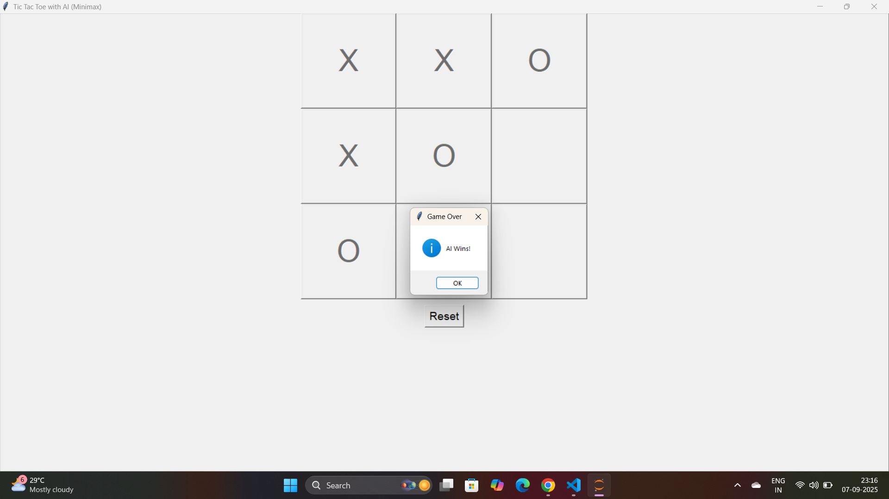

# 🎮 AI Tic Tac Toe (Python + Tkinter)

An intelligent, single-player Tic Tac Toe game built using **Python** and **Tkinter**, featuring a smart AI opponent powered by the **Minimax algorithm**.

---

## 🚀 Features

- 🤖 Play against a smart AI (Minimax)
- 🎲 Classic 3x3 grid with intuitive GUI
- 🧠 AI never loses — implements unbeatable strategy
- 🔄 Real-time win/draw detection & reset button
- 👨‍💻 Built with Python and Tkinter (no external libraries)

---
## 📸 Screenshot

 


## 💻 How to Run

```bash
python tic_tac_toe_ai.py
